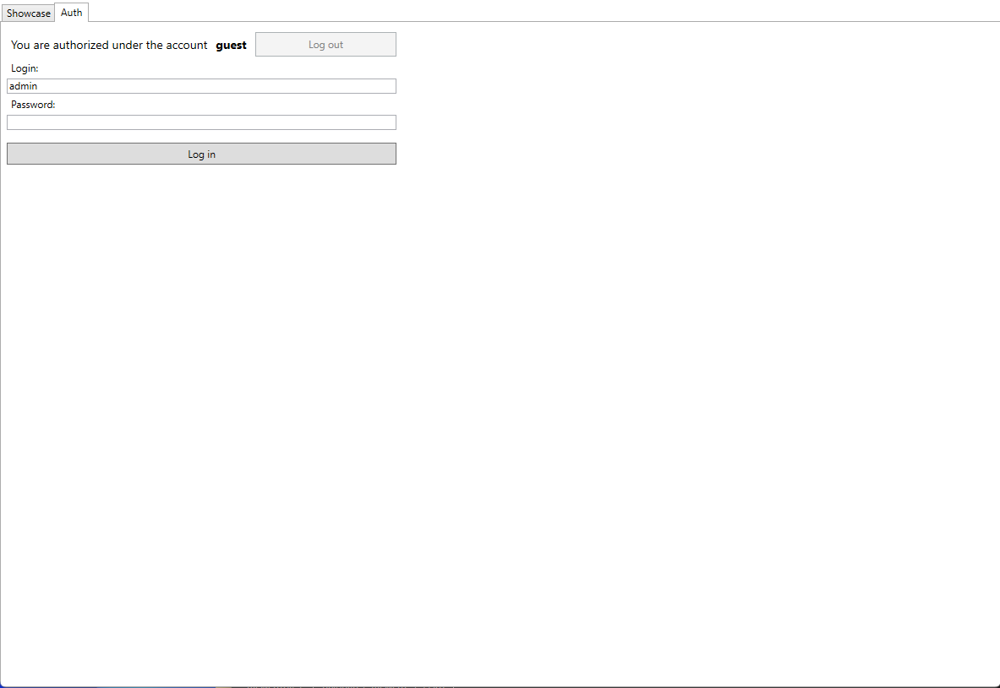
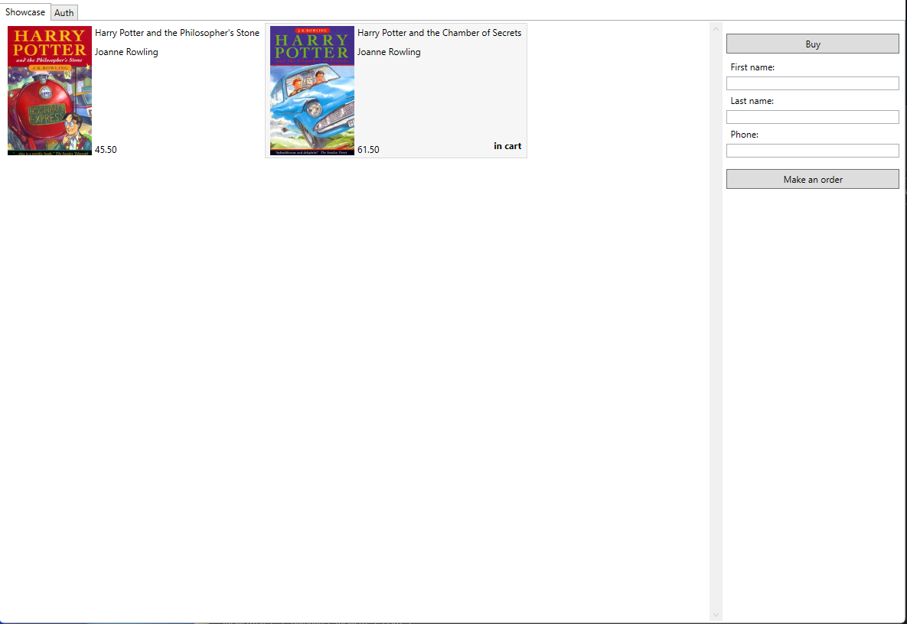
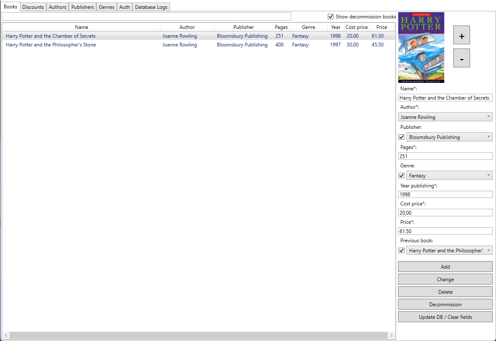
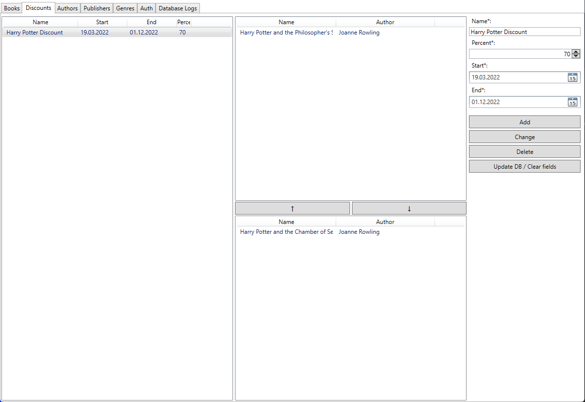

*[English](README.md) ∙ [Русский](README-ru.md)* <!-- l10n:select -->

# Book Store

Exam project "Book Store" using .NET5, C#, WPF, MSSQL, EF Core, Logging and LINQ

## Requirements / Features

**The main objective of the project**: to take into account the current range of books in the store.

* [x] It is necessary to store the following information about books:
    - name of the book
    - Name of the author
    - name of the publisher
    - number of pages
    - genre
    - the year of publishing
    - prime cost
    - sale price.
* [x] Whether the book is a continuation of some other book (for example, the second part of a dilogy).
* [x] The application must allow:
    - add books
    - delete books
    - edit book options
    - sell books
    - copy books
    - contribute books to promotions (for example, a week of New Year-themed books with a 10% discount)
    - set aside books for a specific buyer.
* [x] The application must provide the functionality to search for books by the following parameters:
    - name of the book
    - author
    - genre
* [x] It is necessary to provide for the possibility of logging in with a login and password.

## Screenshots

